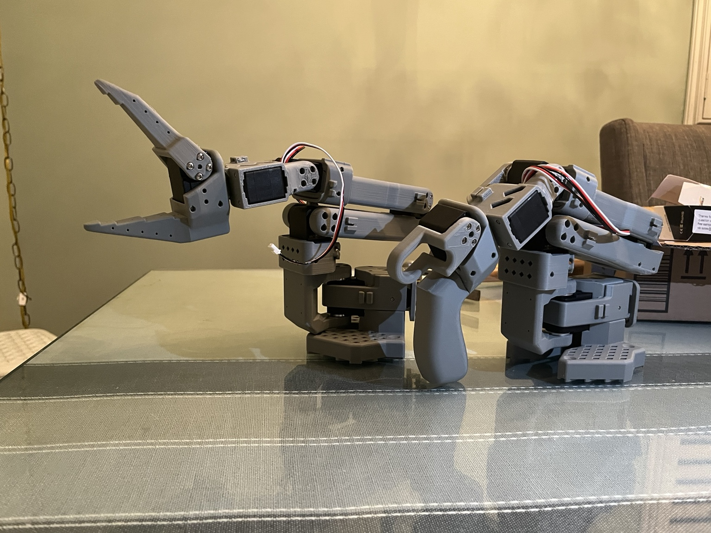
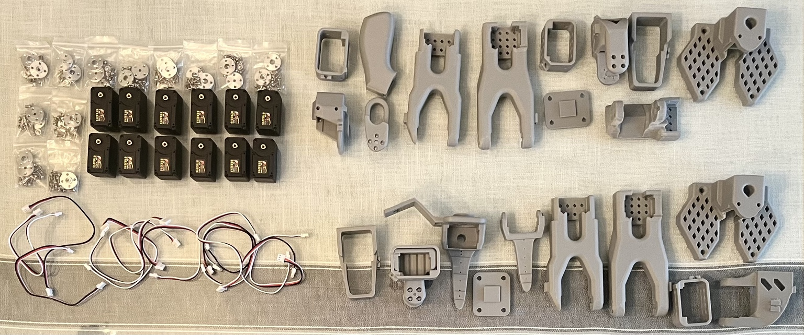
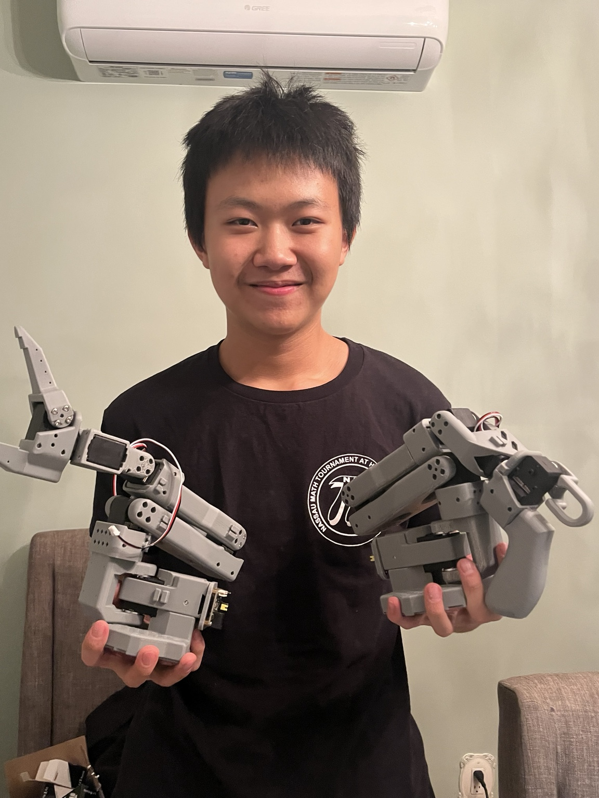

# SO-101 Vision-Based Imitation Learning

A real-world robotics project using a dual-camera SO-101 arm, Hugging Face LeRobot, and ACT imitation learning to study autonomous pick-and-place from human demonstrations.

  

**Current result:** a policy trained on 50 demonstrations successfully performs the bottle-to-box task. In a small physical evaluation, the 50-demo / 10k model achieved **14/20 successes (70%)**, while the same model fine-tuned for another 10k updates achieved **16/20 (80%)**.

**Project duration:** 7-day development sprint · **22+ hours of active work** across CAD, assembly, calibration, camera integration, data collection, model training/debugging, and physical evaluation. Unattended 3D-print and compute time are excluded.

### Video comparison

- [25 demos / 10k + 10k fine-tuning — failure example](media/25_demo_10k_plus_10k_failure.mp4)
- [50 demos / 10k + 10k fine-tuning — successful example](media/50_demo_10k_plus_10k_success.mp4)

## What I Built and What Already Existed

This project builds on the open-source **SO-101** hardware platform, **LeRobot**, and the existing **ACT** imitation-learning implementation. I did not design the original arm or invent ACT.

My work was the system integration and experimentation: I 3D-printed and assembled the arms, configured and calibrated the servos, established teleoperation, integrated two cameras, designed a custom base-camera mount, collected the demonstrations, trained and evaluated the policies, and debugged the hardware/software stack.

A more explicit scope breakdown is in [ATTRIBUTION.md](ATTRIBUTION.md).

## System

| Component | Configuration |
| --- | --- |
| Robot | SO-101 leader + follower |
| Actuators | Feetech STS3215 smart servos |
| Vision | Base camera + wrist camera |
| Capture | 640×480 at 30 FPS |
| Framework | Hugging Face LeRobot |
| Policy | ACT imitation learning |
| Training GPU | NVIDIA GeForce RTX 4050 Laptop GPU |
| Task | Pick up the white bottle and place it in the white box |

**Pipeline:** human teleoperation → dual-camera + joint-action recording → LeRobot dataset → ACT training → autonomous rollout → physical evaluation

## Experiment Progression

### 1. 25 demonstrations / 10k updates

The first policy generally moved toward the bottle but was shaky and repeatedly missed to the right.

### 2. Same 25 demonstrations / +10k fine-tuning

I initialized from the 10k policy weights and trained for another 10k updates on the **same 25 demonstrations**. The rightward bias became worse rather than disappearing.

This suggested that the main issue was not simply insufficient optimization.

> These “+10k” runs were initialized from the previous model weights with a fresh optimizer. They are therefore described as **10k + 10k fine-tuning**, not as a true continuous 20k optimizer-state resume.

### 3. 50 demonstrations / 10k updates

I collected 25 additional demonstrations with greater spatial variation and smoother, more deliberate trajectories, then trained a fresh policy on all 50 demonstrations.

The new model successfully completed the task and was visibly smoother and more accurate.

### 4. Same 50 demonstrations / +10k fine-tuning

I then initialized from the 50-demo / 10k weights and performed another 10k updates on the same 50-demo dataset.

## Physical Evaluation

Each placement category used 5 trials per checkpoint.

| Test position | 50 demos / 10k | 50 demos / 10k + 10k fine-tuning |
| --- | ---: | ---: |
| Center | 5/5 | 5/5 |
| Close Right | 0/5 | 3/5 |
| Slight Left | 5/5 | 4/5 |
| Big Swing | 4/5 | 4/5 |
| **Overall** | **14/20 (70%)** | **16/20 (80%)** |

These are small-sample engineering tests, not a statistically conclusive benchmark. Also, the added 25 demonstrations were both **more numerous and more varied**, so this experiment does not isolate dataset size from demonstration quality/diversity.

Raw results are in [results.csv](results.csv). The full development and experiment history is in [EXPERIMENTS.md](EXPERIMENTS.md).

## Custom Camera Integration

The follower uses two visual viewpoints:

- a fixed base camera for the overall workspace;
- a wrist-mounted camera for close-up grasp information.

  
  

I designed the base-camera mount in **Onshape** and 3D-printed it for the physical system. The printable STL, editable STEP file, and design notes are in [hardware/camera_mount/](hardware/camera_mount/).

## Build Process

  

  

The dated build log documents printing, assembly, calibration, camera integration, model training, debugging, and evaluation: [EXPERIMENTS.md](EXPERIMENTS.md).

The sanitized LeRobot commands used for teleoperation, recording, replay, training, fine-tuning, and rollout are in [real_robot/README.md](real_robot/README.md).

## Key Engineering Lessons

The largest improvement came from expanding the demonstration distribution rather than continuing to optimize the original 25-demo dataset. In the pilot experiment, more training reinforced an existing positional bias; after expanding to 50 demonstrations, the policy became substantially more capable.

The project also made clear how coupled a real robot-learning stack is: mechanical calibration, camera placement, USB reliability, demonstration quality, dataset coverage, GPU configuration, and control-loop timing all affect physical behavior.

## Next Research Step

The planned next phase is to reproduce the task in **NVIDIA Isaac Lab** and investigate:

> **Can simulation pretraining reduce the amount of real-world demonstration data required for a low-cost SO-101 arm?**

The planned comparison is real-only versus simulation-assisted learning evaluated on the same physical task. See [isaac_lab/README.md](isaac_lab/README.md).

## Acknowledgements

This project depends on the open-source work of The Robot Studio, Hugging Face LeRobot contributors, the ACT research/codebase incorporated into LeRobot, PyTorch, OpenCV, FFmpeg, and the broader open-source robotics community.
