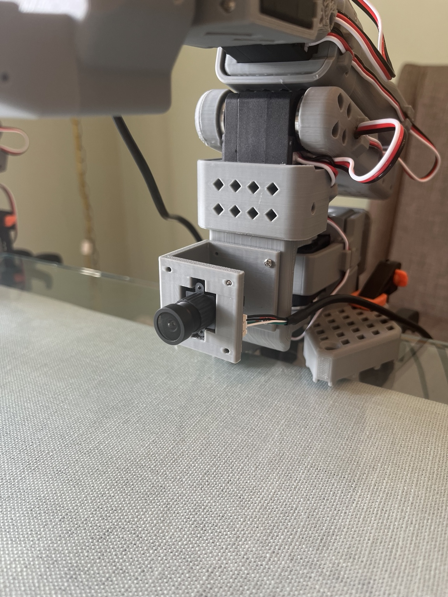
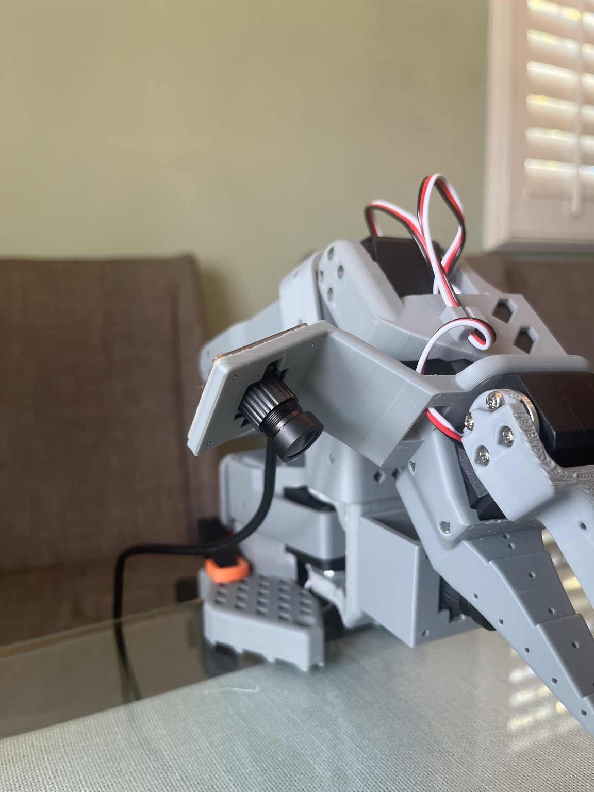

# Hardware

The physical system uses an SO-101 leader arm for teleoperation and an SO-101 follower arm for autonomous execution.

## Configuration

- SO-101 leader/follower architecture
- Feetech STS3215 smart servos
- 3D-printed structural components
- Base-mounted USB camera
- Wrist-mounted USB camera
- Custom 3D-printed base-camera mount

The SO-101 platform itself is existing open-source hardware. My work here was printing and assembling the system, wiring/configuring the servos, calibrating joint limits, integrating the cameras, and designing the custom base-camera mount.

## Custom CAD

The base-camera mount files and design notes are in [camera_mount/](camera_mount/).

  
  

A broader view of the assembled leader/follower system is available in [../media/](../media/).
